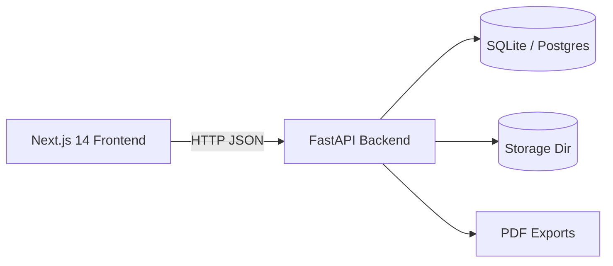

# Architecture Overview

## High-level diagram

## Components

- **Frontend**: Next.js App Router, TypeScript, Tailwind, TanStack Query.
- **Backend**: FastAPI + SQLModel + Alembic.
- **DB**: SQLite by default (`dev.db`), Postgres optional.
- **Storage**: local directory (`storage/`) for uploads and exports.
- **PDF exports**: ReportLab renders PDFs saved into storage.

## Multi-tenant model

- Tenant = **School**
- Rows are scoped by `school_id`.
- Requests validate tenant via token and guard dependencies.
- Cross-tenant access returns `404` to avoid leakage.

## Main domain flow

1. **Project** created by school admin/tutor.
2. **Session** created for a project.
3. **Attendance** saved for session students.
4. **Export** generated (attendance register PDF).
